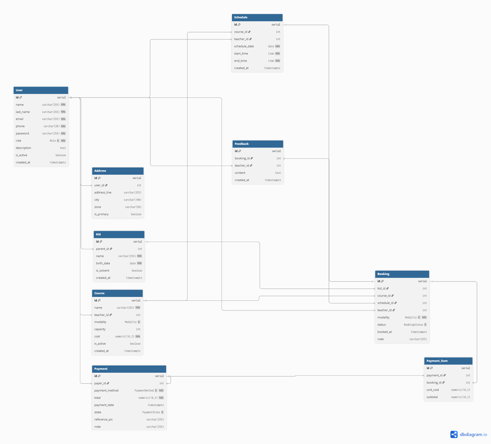

# Ellie's Music Academy --- Documento ERD

Este documento describe el **modelo entidad--relación (ERD)** de la base
de datos de **Ellie's Music Academy**.

------------------------------------------------------------------------

## Descripción general

El modelo de datos se diseñó para cubrir los procesos principales de la
academia: gestión de usuarios, registro de hijos (alumnos), asignación
de cursos, reservas de clases, pagos y retroalimentación de maestros.

Se emplearon **tipos enumerados (ENUMs)** para garantizar integridad en
campos con valores limitados, como roles de usuario, modalidad de curso,
estado de reserva y estado de pago.

------------------------------------------------------------------------

## Entidades principales

### 1. Usuario (User)

-   Contiene la información básica de cada persona en el sistema:
    administradores, maestros y padres.\
-   Cada usuario tiene un rol (`admin`, `maestro`, `padre`).\
-   Los maestros pueden incluir una descripción profesional.\
-   Los padres pueden registrar a sus hijos.

### 2. Dirección (Address)

-   Almacena direcciones asociadas a un usuario.\
-   Se permite indicar una dirección principal por usuario.

### 3. Hijo / Alumno (Kid)

-   Registra a los hijos de un usuario con rol padre.\
-   Incluye datos personales y el estado de solvencia.

### 4. Curso (Course)

-   Representa las clases disponibles en la academia.\
-   Está asociado a un maestro.\
-   Define capacidad, costo y modalidad (`academia` o `domicilio`).

### 5. Horario (Schedule)

-   Define sesiones específicas de un curso.\
-   Incluye fecha, hora de inicio y fin, y el maestro asignado.

### 6. Reserva (Booking)

-   Permite a los padres reservar una clase para un hijo.\
-   Está vinculada a un curso, horario y maestro.\
-   Incluye modalidad y estado de la reserva (`programada`, `cancelada`,
    `completada`).

### 7. Feedback del maestro (Feedback)

-   Comentarios y retroalimentación registrados por los maestros después
    de una clase.\
-   Asociados directamente a una reserva.

### 8. Pago (Payment)

-   Representa un pago realizado por un padre o administrador.\
-   Incluye monto, método de pago (`efectivo`, `transferencia`) y estado
    (`pendiente`, `solvente`, `cancelado`).\
-   Puede incluir una referencia o comprobante.

### 9. Detalle de pago (Payment_item)

-   Relaciona pagos con reservas específicas.\
-   Permite desglosar los pagos por clase o grupo de clases.

------------------------------------------------------------------------

## Relaciones clave

-   **User → Address:** Un usuario puede tener varias direcciones.\
-   **User (padre) → Kid:** Un padre puede registrar varios hijos.\
-   **User (maestro) → Course:** Un maestro puede impartir múltiples
    cursos.\
-   **Course → Schedule:** Cada curso tiene múltiples horarios
    asociados.\
-   **Kid → Booking:** Cada hijo puede tener varias reservas.\
-   **Booking → Feedback:** Cada reserva puede generar retroalimentación
    de un maestro.\
-   **Payment → Payment_item → Booking:** Un pago puede cubrir múltiples
    reservas.

------------------------------------------------------------------------

## Imagen del diagrama

------------------------------------------------------------------------

## Notas finales

-   El diseño aplica reglas de normalización para evitar redundancia y
    mantener integridad.\
-   Se agregaron restricciones y triggers para asegurar consistencia
    entre reservas, cursos, horarios y maestros.\
-   El modelo está optimizado para consultas frecuentes mediante índices
    en campos clave.\
-   El sistema cuenta con auditoría de cambios para trazabilidad
    completa.
